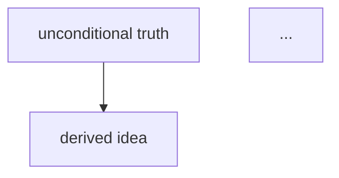

# Recap

Turn a teaching session into **one note the learner can reload their understanding from months later**, and put it in their Obsidian vault.

This is not a transcript, a log, or a summary of the conversation. Nobody re-reads a conversation. The note is a **compressed artifact of the understanding**, written so that a person who never saw the session — including the learner, after forgetting all of it — can rebuild the ideas from the note alone.

> [!important] The test for every line you write
> *Would this line still work for someone who wasn't there?*
> If it needs the conversation to make sense ("as we saw above", "the example you gave"), rewrite it or cut it.

## What makes a note worth re-reading

A recap note that just lists what was covered is worthless — the learner already has a table of contents; what they've lost is the **structure and the motivation**. So the note carries, in order of importance:

1. **The compression.** The whole session in one paragraph. If a session's ideas can't be compressed, they weren't understood — and writing this paragraph is how you find out.
2. **The dependency graph.** Which ideas rest on which. This is the single most valuable thing on the page: it's what turns a pile of facts back into understanding, and it's the thing that's hardest to reconstruct from memory.
3. **The rediscovery path.** Not *what* is true — *why anyone would have looked for it*. A fact whose motivation is lost decays back into an arbitrary thing to memorise.
4. **Mistakes caught.** What the learner actually got wrong during the session, and why the wrong idea was tempting. This is the highest-yield thing on the page to re-read later — a corrected misconception is worth more than a restated fact, because it's the one that would otherwise come back.

Everything else is support.

## Procedure

### 1. Offer one recall prompt (skip if they'd rather not)

Before you write anything, ask them — plain `AskUserQuestion`, ungraded — to say what the main ideas were **from memory**, without scrolling up. Retrieving beats re-reading by a wide margin: what they can't reproduce unprompted is exactly what didn't land, and that gap tells you what the note has to carry.

Keep it to **one** question, and make skipping frictionless — one option is "Just write the note." Whatever they produce, use it: gaps between their recall and the session tell you what to emphasise, and anything they misremember is a **Mistakes to remember** entry, not a correction to skip past.

If they skip, write the note. Do not push twice.

### 2. Find the destination

Learning is organised by **theme**: one note per subject, deepened over many sittings. Check whether one is bound:

```bash
node .claude/skills/recap/theme.mjs current
```

**If a theme is bound, that is the destination — do not ask.** `Read` the note, then go to step 4 and merge into it.

**If nothing is bound**, find a home:

```bash
node .claude/skills/recap/vault.mjs list
```

This prints every Obsidian vault registered on the machine with its folders, its attachment folder, and its link style. Do not guess vault paths — the registry is the only reliable source.

Ask (ungraded `AskUserQuestion`) which vault and which folder, offering the real folders from that output as options. Include a sensible default as the first option, inferred from the vault's own folder names and the topic — an existing folder that already holds notes of this kind beats a new one. Ask for the **note title** in the same call if it isn't obvious.

Then reserve the path:

```bash
node .claude/skills/recap/vault.mjs new "<vault>" "<folder>/<Title>.md"
```

- `NEW` — write it fresh.
- `EXISTS` — **read the file first**, then merge as below. Never overwrite a note blind; the learner may have added their own notes to it.

Once it's written, offer to bind it as a theme so the next session continues it rather than starting over:

```bash
node .claude/skills/recap/theme.mjs bind "<vault>" "<folder>/<Title>.md"
```

### 3. Publish the diagrams into the vault

Any diagram rendered during the session is sitting in `viz/`, which is almost certainly *not* inside the vault. Copy them in, and take the embed text from the output:

```bash
node .claude/skills/recap/vault.mjs viz
node .claude/skills/recap/vault.mjs attach "<vault>" viz/<file>.png viz/<file>.png
```

`attach` prints the exact embed line for each file, matched to that vault's link style. Paste those lines into the note where they belong.

**Inline ```mermaid``` blocks need no publishing** — they are text, they travel with the note, and Obsidian renders them natively. Prefer them; only rendered PNGs need `attach`.

### 4. Write — or merge into — the note

**A theme note is not a log.** It gets *deeper* each session, not longer. The failure mode is appending "Session 2" under "Session 1" and recreating the chronological dump the whole system exists to avoid. So when the note already has content, integrate rather than append:

| Section | How it merges |
|---|---|
| **In one paragraph** | Rewrite it whole. It describes everything understood so far, not today. |
| **The shape of it** | **One graph for the whole theme.** Extend the existing mermaid — add nodes, add edges, re-root if today showed a truer foundation. Never add a second graph. |
| **Key ideas** | Insert new ideas *in dependency order among the existing ones*, where they actually belong. Sharpen any wording today proved was vague. Never a dated block. |
| **How you'd rediscover this** | Extend the path. If today reached further, the path now runs further. |
| **Worked example** | Keep the two or three that carry the most; replace a weak one rather than stacking a fifth. |
| **Mistakes to remember** | Accumulate — these are the highest-value lines on the page. Dedupe near-identical entries. If an old one was re-tested and held, leave it; if it recurred, say it recurred. |
| **Open threads** | **Remove what today closed**, add what today opened. A stale thread that's actually been covered is worse than no thread. |

Forbidden in a theme note: date headings, "Session N", "Today we covered", "Previously". If a reader can tell where one sitting ended and the next began, the merge failed.

Keep anything the learner wrote themselves. If you must contradict something already in the note, correct it and note the correction under **Mistakes to remember** — a corrected misconception is worth recording.


**Match the vault's own conventions.** For a *new* note, read a sibling note, or the vault's templates folder if it has one, before writing — use its frontmatter keys and its section names rather than inventing parallel ones. A vault that calls this section "Key ideas" should get "Key ideas", not "Core concepts". The skeleton below is a starting point, not a form to fill in: **cut any section the session didn't earn**, and never leave an empty heading behind.

````markdown
---
type: concept
tags:
  - concept
status: seedling
related:
---

<!-- Frontmatter is a guess. Match whatever keys this vault already uses. -->

# <Title>

> [!abstract] In one paragraph
> The whole thing, compressed. What the idea is, what it's for, and why it
> looks the way it does. If you can only re-read one box, this is it.

## The shape of it



One sentence under the graph saying what the arrows mean.

## Key ideas

Each idea as a claim that stands on its own, with the thing it rests on named.
Not a bullet list of topics — a list of *statements that are true*, in an order
where each one is supported by the ones above it.

## How you'd rediscover this

The motivated path, compressed to its turning points: the problem that forces
the idea, the move someone would reach for, and why that move works. This is
the section that stops the material decaying into memorisation.

## Worked example

One concrete instance, worked through completely. Concrete beats general for
reloading a memory — the abstract statement is in **Key ideas**; this is the
thing that makes it click again.

## Mistakes to remember

What was actually got wrong during the session, and *why* the wrong model was
tempting. Omit only if genuinely nothing was missed.

## Open threads

What we deliberately didn't cover, and what the natural next step is.

## Links

- [[related note]]
````

Write in **the learner's own register** — direct, no throat-clearing, no "in this session we explored". Where the subject uses notation, write it as LaTeX (`$f(x)$`, `$$…$$`) — Obsidian renders it natively. Where it doesn't, don't manufacture any.

### 5. Report back

Tell them the absolute path, and one line on what changed — for a merge, what's new in it, not what it contains overall. Nothing more.

## Rules

- **One note per theme, not per session.** Many sittings deepen one note. Not one per concept either. If the session genuinely produced a separate idea that outlives it, mention it in **Links** as a `[[wikilink]]` to a note that doesn't exist yet — Obsidian shows those as unresolved, which is a fine to-do — and offer to write it. Don't scatter files unasked.
- **Never dump the conversation.** No "you asked / I said", no chronology, no quoted exchanges.
- **Never write outside the vault the user picked**, and never create a note they didn't agree to.
- **If the session was short or nothing was really taught, say so** and don't manufacture a note out of three exchanges.
