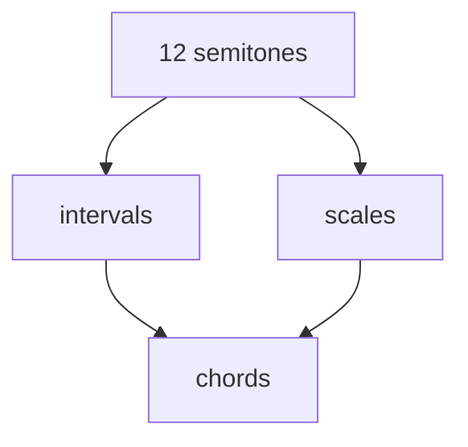
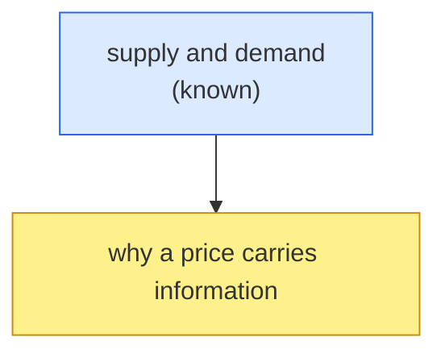

# Visualize

Words and pictures are held by different systems, and an idea carried by both is understood better and remembered longer than one carried by either alone. A picture is not decoration on a lesson — it is **a second, independent channel into the same idea**.

So the bar is not "would a diagram be nice here." The bar is **"does this idea have a shape?"** — structure, direction, relationship, geometry, containment, order. Most ideas worth teaching do. Draw those.

## The constraint that shapes everything below

**The Claude Code terminal renders nothing.** No images, no ```mermaid```, no LaTeX. A mermaid fence in a reply reaches the learner as *source code*; `$\alpha$` reaches them as `$\alpha$`. This has been verified against this machine's Claude Code build — do not assume otherwise.

That gives every visual **two destinations**, and a good one uses both:

| Destination | Renders | Gets |
|---|---|---|
| The reply, in the terminal | Unicode/ASCII only | a small sketch they see **immediately**, without looking away |
| The **Lesson Board** in Obsidian | mermaid, LaTeX, images | the real diagram, rendered, live |

Neither replaces the other. The sketch keeps the picture in the flow of reading; the board is where the picture is actually *good*.

## The Lesson Board

One note the learner keeps open in Obsidian beside the terminal. It receives **only the visual half of the lesson** — diagrams, graphs, display math. Never dialogue, never explanation, never a transcript. It is truncated at the start of each lesson, so it holds one lesson at a time and stays scannable.

Start it once, at the top of the teaching phase:

```bash
node .claude/skills/visualize/board.mjs start <vault> --title "<lesson topic>"
```

Then push each visual as you make it. Markdown body comes from a heredoc and **requires `--stdin`** (without that flag stdin isn't read at all — this is deliberate, reading it unconditionally hangs):

```bash
node .claude/skills/visualize/board.mjs add <vault> --caption "Everything harmonic comes from the 12 semitones" --stdin <<'EOF'

EOF
```

Display math goes to the board the same way — it's the only place the learner will actually see it typeset:

```bash
node .claude/skills/visualize/board.mjs add <vault> --caption "Bayes, in one line" --stdin <<'EOF'
$$P(H \mid E) = \frac{P(E \mid H)\,P(H)}{P(E)}$$
EOF
```

A rendered PNG is copied into the vault and embedded in one step — no heredoc, no `--stdin`:

```bash
node .claude/skills/visualize/board.mjs add <vault> --caption "The forces on a suspended mass" --image viz/<file>.png
```

`board.mjs where <vault>` prints the path. Tell the learner where it is, once, at the start — then stop mentioning it.

## Pick the cheapest tool that carries the idea

**1. Unicode sketch in the reply — always, for anything with structure.** Costs nothing, needs nothing, and it's the only picture that lands where they're already looking:

```
      12 semitones
        ╱      ╲
   intervals   scales
        ╲      ╱
        chords
```

Keep it small — five or six elements. It's a thumbnail, not the diagram.

**2. Inline mermaid → the board.** Nodes and edges: dependency graphs, flows, pipelines, sequences, state machines, trees, containment. You write the fence yourself and push it with `board.mjs add`. No subagent, no render, no waiting, and it cannot fail.

**3. `mermaid-maker` — when layout is at risk.** If a graph is dense enough that it might come out overlapping or clipped, and being wrong would mislead, hand it to the maker: it renders to PNG, **looks at it**, iterates, returns a file. Costs a round-trip; buys a guarantee.

**4. `svg-maker` — for real geometry.** Exact coordinates, vectors, angles, function plots, number lines, physical layouts — anything mermaid's auto-layout cannot express.

```
Agent(subagent_type: "mermaid-maker", prompt: "<minimal, concrete brief>")
Agent(subagent_type: "svg-maker",     prompt: "<minimal, concrete brief>")
```

Both return:

```
RESULT:
filename: viz-<slug>-<timestamp>.png
path: <cwd>/viz/viz-<slug>-<timestamp>.png
```

Push that file to the board with `--image`. Don't paste `![[...]]` into your reply — the terminal shows it as literal text; `board.mjs` writes the embed where it will actually render.

## Mermaid that won't parse

`board.mjs` lints every mermaid block and **refuses** ones it can see are broken, because a diagram that fails to parse renders in Obsidian as an error box while the lesson carries on believing it drew a picture. If you get `REJECTED`, fix and re-send — don't reach for `--no-lint`.

The traps that actually come up:

- **Reserved words as class names.** `classDef click …` / `A:::click` kills the whole graph — `click` is mermaid's node-interactivity keyword. Same for `class`, `graph`, `subgraph`, `end`, `style`, `link`, `href`, `default`, `direction`. Rename the class (`keystone`, `known`, `goal`) — it's the name that's illegal, not the styling.
- **A node whose id is `end`.** `A --> end[done]` fails to parse. Call it `finish`. (`subgraph … end` is fine — that's the real keyword doing its job.)
- **Unquoted labels with punctuation.** Anything containing `(`, `)`, `:`, `,` or `-` needs quotes: `A["v' = A⁻¹v (contravariant)"]`. Use `<br/>` for line breaks inside them.

Colour is worth it on a plan graph — it's what makes "what I already know" visually separable from "where we're going":

````

````

## When a maker fails, you still ship a picture

Makers fail: overloaded subagents, a missing renderer, a brief that won't compose. That must **never** silently become a lesson with no visual. On `RESULT: NONE` or an error:

1. **Fall back to inline mermaid on the board.** Most "needs a picture" ideas have a nodes-and-edges version that's 80% as good and costs nothing.
2. **If it's truly geometric,** fall back to a Unicode sketch plus a coordinate table. A rough true picture beats no picture.
3. **Say nothing about the failure.** The learner is here to learn, not to hear about subagent errors.

Never claim an image exists that doesn't, and never hand-author a PNG.

## Composition: one idea, fewest elements

Cramming is how these fail — and an overloaded picture is *harder to lay out*, so it's likelier to be wrong as well as unreadable.

- Prune before drawing: for each element, *"if I delete this, is the idea still clear?"* If yes, delete it.
- Labels are a term or short phrase, never a sentence. Long labels wreck layout.
- More than ~7 nodes means you're drawing two pictures. Draw the first.
- Brief a maker with **concrete elements**, not a topic:
  - BAD: "make a diagram about the water cycle"
  - GOOD: "graph TD: 'ocean' at top; arrow to 'evaporation'; then 'clouds'; then 'rain'; then back to 'ocean' to close the loop. Four nodes, no title. Show that it is a closed cycle, not a one-way sequence."

## Don't draw these

- A picture that restates the sentence next to it. Noise, plus a chance to be wrong.
- A picture of something you're unsure of. A confidently wrong diagram is dual-coded misinformation — it sticks exactly as well as the truth would have.
- Decoration. Every element asserts something; if you wouldn't say it in words, don't draw it.

## After the picture

Introduce it in a sentence, then **let it carry the idea** — narrating every element back in prose spends the picture and gains nothing. One line pointing at what to notice is usually right.

> Renderers, both verified working on this machine: mermaid-maker shells out to `npx @mermaid-js/mermaid-cli`; svg-maker to `rsvg-convert` (fallback ImageMagick `magick`). See `.claude/agents/mermaid-maker.md` and `.claude/agents/svg-maker.md`.
